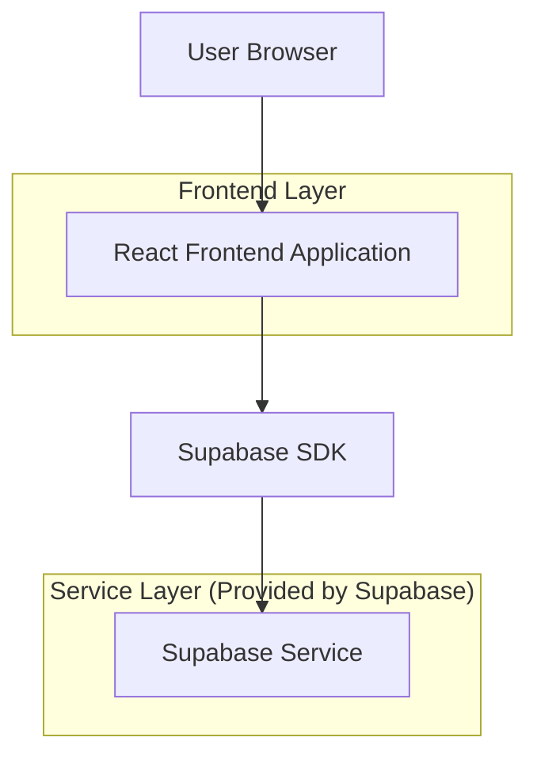
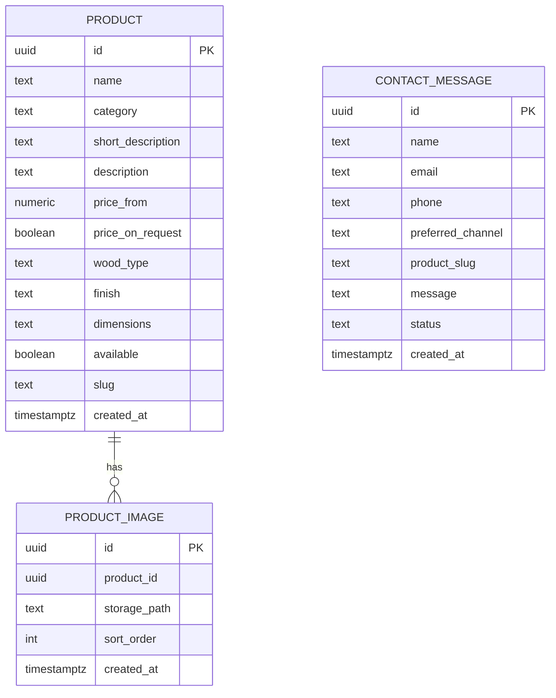

## 1.Architecture design


## 2.Technology Description
- Frontend: React@18 + vite + tailwindcss@3
- Backend: Supabase (PostgreSQL + Storage)

## 3.Route definitions
| Route | Purpose |
|-------|---------|
| / | Home, apresenta marca, categorias e destaques |
| /produtos | Catálogo/Produtos com filtros, busca e detalhe rápido |
| /contato | Formulário e canais diretos de contato/orçamento |

## 6.Data model(if applicable)

### 6.1 Data model definition


### 6.2 Data Definition Language
Product Table (products)
```
CREATE TABLE products (
  id UUID PRIMARY KEY DEFAULT gen_random_uuid(),
  name TEXT NOT NULL,
  category TEXT NOT NULL CHECK (category IN ('colheres','tabuas','personalizados')),
  short_description TEXT,
  description TEXT,
  price_from NUMERIC(10,2),
  price_on_request BOOLEAN DEFAULT false,
  wood_type TEXT,
  finish TEXT,
  dimensions TEXT,
  available BOOLEAN DEFAULT true,
  slug TEXT UNIQUE NOT NULL,
  created_at TIMESTAMPTZ DEFAULT NOW()
);

CREATE INDEX idx_products_category ON products(category);
CREATE INDEX idx_products_created_at ON products(created_at DESC);
CREATE INDEX idx_products_slug ON products(slug);

-- Permissões (leitura pública do catálogo)
GRANT SELECT ON products TO anon;
GRANT ALL PRIVILEGES ON products TO authenticated;
```

Product Images Table (product_images)
```
CREATE TABLE product_images (
  id UUID PRIMARY KEY DEFAULT gen_random_uuid(),
  product_id UUID NOT NULL,
  storage_path TEXT NOT NULL,
  sort_order INT DEFAULT 0,
  created_at TIMESTAMPTZ DEFAULT NOW()
);

CREATE INDEX idx_product_images_product_id ON product_images(product_id);

GRANT SELECT ON product_images TO anon;
GRANT ALL PRIVILEGES ON product_images TO authenticated;
```

Contact Messages Table (contact_messages)
```
CREATE TABLE contact_messages (
  id UUID PRIMARY KEY DEFAULT gen_random_uuid(),
  name TEXT NOT NULL,
  email TEXT,
  phone TEXT,
  preferred_channel TEXT CHECK (preferred_channel IN ('whatsapp','email','telefone')),
  product_slug TEXT,
  message TEXT NOT NULL,
  status TEXT DEFAULT 'new' CHECK (status IN ('new','in_progress','done')),
  created_at TIMESTAMPTZ DEFAULT NOW()
);

CREATE INDEX idx_contact_messages_created_at ON contact_messages(created_at DESC);

-- Permissões (mínimo viável): permitir INSERT anônimo para formulário
GRANT INSERT ON contact_messages TO anon;
GRANT ALL PRIVILEGES ON contact_messages TO authenticated;
```

Storage (imagens)
- Bucket sugerido: `product-images`
- Leitura pública para imagens do catálogo.

Notas de segurança (MVP)
- Preferir habilitar RLS e criar políticas explícitas: leitura pública em `products`/`product_images` e inserção limitada em `contact_messages`.
- Se houver abuso/spam, evoluir para uma Edge Function no Sup